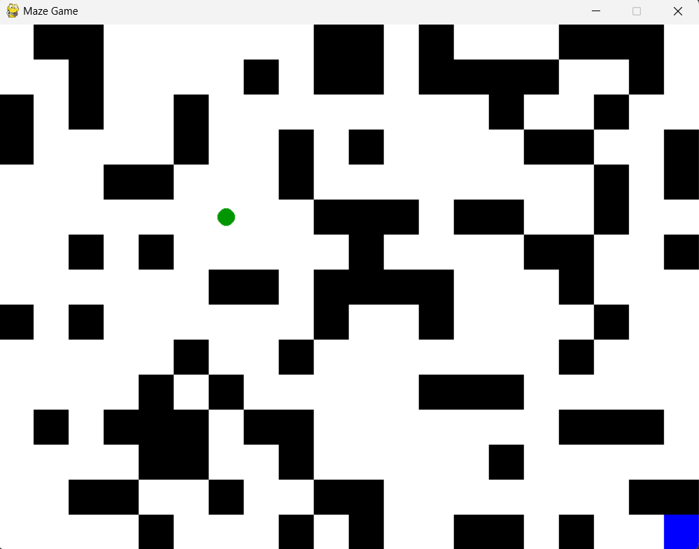

```markdown
```
# Maze Game

This is a simple maze game implemented using Pygame library in Python. The game generates a random maze and allows the player to navigate through it using arrow keys or WASD keys to reach the destination cell marked in blue.

### Game Rules
- The game window is set to 800x600 pixels.
- Each cell in the maze is 40x40 pixels.
- Walls are randomly generated with a 30% chance per cell.
- The player starts at the top-left corner and must reach the bottom-right corner to win.
- The player can move using arrow keys (up, down, left, right) or the keys W (up), A (left), S (down), D (right).
- The maze is regenerated each time the player reaches the destination.

### Installation
1. Ensure you have Python installed on your system.
2. Install Pygame library using pip:
   ```bash
   pip install pygame
   ```

### How to Run
1. Clone the repository:
   ```bash
   git clone https://github.com/your_username/maze-game.git
   cd maze-game
   ```
2. Run the game:
   ```bash
   python maze_game.py
   ```

### Controls
- **Move Up:** Up Arrow key or W key
- **Move Down:** Down Arrow key or S key
- **Move Left:** Left Arrow key or A key
- **Move Right:** Right Arrow key or D key

### Game Screenshot


### Acknowledgements
- The maze generation algorithm is based on randomized depth-first search (DFS) using a stack.
- Pygame library is used for graphics and event handling.

### Future Improvements
- Implement levels with increasing difficulty.
- Add more features such as timers, scoring, or multiple players.

Feel free to contribute to this project by opening issues or pull requests. Enjoy playing the Maze Game!
```
